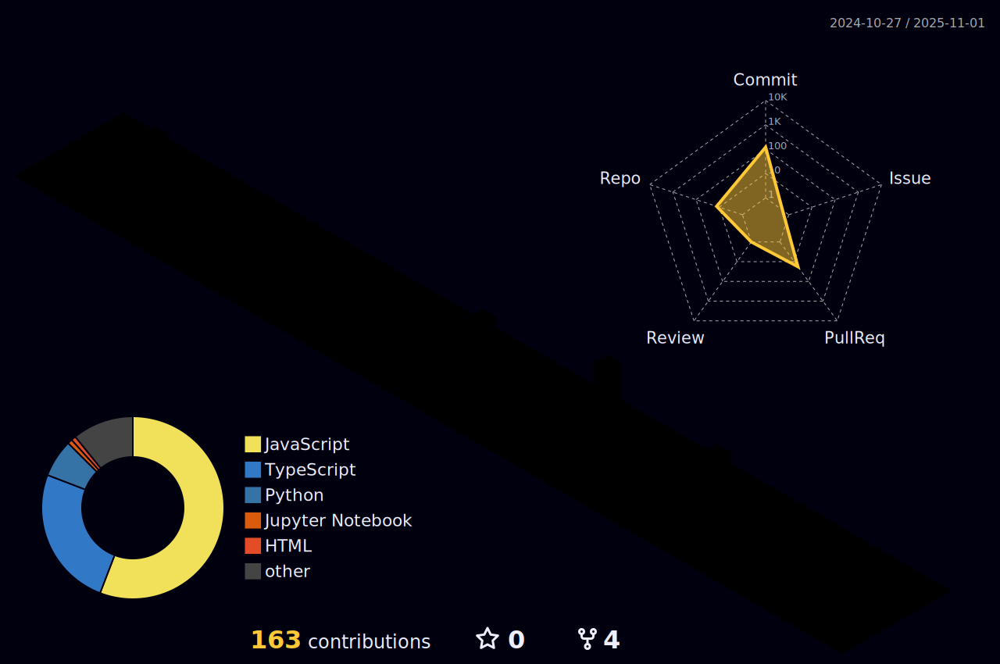

  <h1 align="center">Hi 👋, I'm</h1>

  

  
- 🌱 I’m currently learning C , PYTHON & JAVA 

- 📫 How to reach me **anshikajain1114@gmail.com**
  

   

## My Skill Set 

<table><tr><td>

</td></tr></table>  

   

 
  Visitor count 
  

## Connect with me  

  
  
  
  

 
  

   

## Github Stats  

  
  

   

  
   

 

